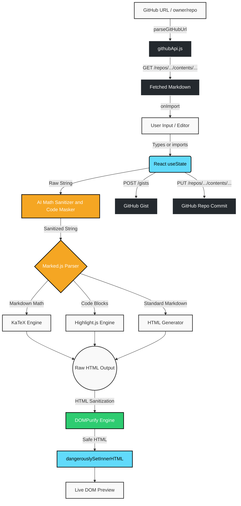

# MARKDOWN LATEX PDF GENERATOR — GitHub Edition
*A Markdown + LaTeX editor with live preview, PDF export, and full GitHub API integration.*

**Project:01 — GitHub Developer Program Edition**
_March 2026 → October 2026_

### Live demo: [Markdown Latex Pdf](https://markdown-pdf-self.vercel.app/)
### Repository: [SuryanshSwarn09/Git-doc](https://github.com/SuryanshSwarn09/Git-doc)
---

### Dev.to article: [Stop Fighting AI Formatting: How I Built a "Sanitizer" for Messy AI Markdown](https://dev.to/suryansh_swarn/stop-fighting-ai-formatting-how-i-built-a-sanitizer-for-messy-ai-markdown-3ooh)

> This project started in March 2026 as a practical Markdown + LaTeX editor. In October 2026 it was extended with a full **GitHub API integration** as part of the GitHub Developer Program — enabling users to import files from repos, save drafts as Gists, and commit Markdown directly to GitHub, all from inside the editor.

### Tech stack
_`React` `Vite` `marked.js` `highlight.js` `KaTeX` `DOMPurify` `GitHub REST API`_

---

## GitHub Integration (New — October 2026)

This version adds a dedicated **GitHub panel** accessible via the `GitHub` button in the top action bar. It connects to three GitHub REST API endpoints using a Personal Access Token (PAT) stored securely in `localStorage`.

### Features

#### Connect — PAT Authentication
- Paste a GitHub Personal Access Token to authenticate
- Token is verified live against `GET /user` and displays your avatar + username on success
- Session is silently restored on every page load from `localStorage`
- One-click **Disconnect** to revoke the session

#### Import — Fetch Markdown from Any GitHub URL
- Paste any of the following and the app fetches and decodes the file automatically:
  - `https://github.com/owner/repo/blob/branch/path/to/file.md`
  - `https://raw.githubusercontent.com/owner/repo/branch/path/to/file.md`
  - `https://github.com/owner/repo` — auto-fetches `README.md`
  - `owner/repo` shorthand — auto-fetches `README.md`
- Shows a preview card (filename, size, content snippet) before loading
- Public repos work **without a token**; private repos require a connected PAT
- All imported content routes through the **existing DOMPurify sanitization pipeline** — no XSS risk

#### Gist — Save Draft as a GitHub Gist
- Saves the current editor content as a new GitHub Gist
- Filename is pre-filled from the document top heading (slugified)
- Toggle between **Public** and **Secret** visibility
- Optional description field
- Returns a direct link to the created Gist on success

#### Commit — Push to a Repository
- Commit the current Markdown file directly to any GitHub repo you have write access to
- Fields: Owner, Repository, File Path, Branch (optional), Commit Message
- Auto-detects whether the file already exists (fetches SHA via `GET /repos/.../contents/...`) and sends a create or update accordingly
- Returns a direct link to the committed file on GitHub

### GitHub API Endpoints Used

| Feature | Method | Endpoint |
|---|---|---|
| Token verification | `GET` | `/user` |
| Import file | `GET` | `/repos/{owner}/{repo}/contents/{path}` |
| Get file SHA (for updates) | `GET` | `/repos/{owner}/{repo}/contents/{path}` |
| Create Gist | `POST` | `/gists` |
| Commit file | `PUT` | `/repos/{owner}/{repo}/contents/{path}` |

### Setup — Getting a Personal Access Token

1. Go to [github.com/settings/tokens/new](https://github.com/settings/tokens/new)
2. Give it a name (e.g. `markdown-editor`)
3. Select scopes: `repo` (for commits) and `gist` (for Gists)
4. Click **Generate token** and copy it
5. Open the app → click **GitHub** → paste in the **Connect** tab

> **Security note:** The token is stored only in your browser's `localStorage` and is only ever sent to `api.github.com` over HTTPS. The app has no backend and does not transmit your token anywhere else.

### New Files Added

| File | Purpose |
|---|---|
| `src/utils/githubApi.js` | All GitHub REST API calls, PAT storage, URL parsing |
| `src/components/GitHubModal.jsx` | 4-tab modal UI (Connect / Import / Gist / Commit) |
| `src/components/Icons.jsx` | `GitHubIcon` SVG appended |
| `src/App.jsx` | GitHub button, `githubUser` state, on-mount token restore |
| `src/styles.css` | `gh-` prefixed CSS (button, modal, tabs, cards, spinner) |

---

## All Features

* **GitHub Integration:** Import Markdown from any public or private repo, save drafts as Gists, and commit files to repositories without leaving the editor. Uses the GitHub REST API with PAT authentication. _(October 2026)_
* **Automatic Table of Contents (TOC) Generator:** One-click toolbar button that parses all `#`, `##`, and `###` headings (safely ignoring code blocks and LaTeX math), generates a nested hyperlinked Markdown list with GitHub-compatible anchor slugs, and enables smooth-scrolling navigation in the live preview. Intelligently updates existing TOC blocks in place and preserves browser `Ctrl+Z` undo history.
* **Custom Print Running Header/Footer & Dynamic Page Numbers:** Pre-print layout options enabling running multi-page headers and footers across printed documents and exported PDFs with adaptive `@page` margin allocation and preset persistence.
* **Interactive Print Layout Customizer:** Pre-print modal allowing dynamic publication formatting — multi-column flow, paper size & margins, hierarchical heading numbering, and curated presets with `localStorage` persistence.
* **Synchronized Dual-Pane Scrolling (Scroll-Sync):** Real-time proportional scrolling between the Markdown editor and live preview with mutual recursion lock and a toggle persisted in `localStorage`.
* **Multi-Tiered Responsive Layout Engine:** Fluid responsiveness across all viewports from 1600px desktops down to mobile with balanced action grids.
* **Professional SVG Iconography & Liquid Glass Hierarchy:** Crisp, zero-dependency SVG vector icons with Apple Liquid Glass micro-interactions and accent glow.
* **Hardened Content Security Policy:** Strict HTTP CSP headers prohibiting `unsafe-inline` script execution.
* **Export Sandbox Protection:** Standalone `.html` exports embed an isolated CSP (`default-src 'none'`) preventing arbitrary script execution.
* **Universal Tabnabbing Defense:** Automatic `rel="noopener noreferrer"` on all `target="_blank"` anchors.
* **Theme Persistence & OS Auto-Detection:** Detects `prefers-color-scheme` and persists user theme choices to `localStorage`.
* **Adaptive Code Highlighting:** Syntax tokens adapt to Light and Dark themes via CSS variables with zero stylesheet load latency.
* **Publication Print Typography:** Optimized `@media print` layout with standard sizing (10.5pt body, 9.5pt code) and page-break avoidance.
* **One-Click Markdown Download (`.md`):** Instant download with smart filename slugification from the top heading.
* **Standalone HTML Export (`.html`):** Self-contained HTML documents with inlined KaTeX math stylesheets for offline reading.
* **Rich HTML Clipboard Copy:** Copies rich HTML to the clipboard (supporting `text/html` and `text/plain`) ready to paste into Medium, Dev.to, Google Docs, or email.
* **Auto-Save & Recovery:** Continuous `localStorage` persistence with a visual `Saved` indicator; drafts restore across refreshes.
* **Accidental Clear Protection:** Two-step confirmation modal and an instant `Undo Clear` restore action.
* **Preserved Undo History (`Ctrl+Z` / `Cmd+Z`):** Toolbar formatting preserves the browser native textarea undo/redo history.
* **Tab & Shift+Tab Indentation:** Indent/unindent by 2 spaces without losing editor focus.
* **Live Document Metrics:** Real-time word count, character count, and estimated reading time badges.
* **AI Auto-Formatter:** Sanitizes AI-generated LaTeX math delimiters while preserving code blocks and inline code.
* **XSS Defense:** Full DOMPurify sanitization pipeline securing rendered preview output.
* **Zero-Lag Typing:** React 19 `useDeferredValue` decoupling keystroke input from math parsing and syntax rendering.
* **PWA:** Installable from the browser address bar.
* **Comprehensive Test Suite:** 10 unit test suites (`npm test`) covering math sanitization, syntax highlighting, document metrics, keyboard indentation, export utilities, theme persistence, scroll sync, print layout, TOC generation, and print rendering.

---

### Scripts

* `npm run dev` — Start local development server
* `npm run build` — Produce code-split production bundle
* `npm test` — Run full unit test suite
* `npm run lint` — Run ESLint checks

---

> Funfact: this readme file is also edited first on the [markdown-pdf](https://markdown-pdf-self.vercel.app/) webapp, then pasted into VS Code.

---

### Architecture Flow

